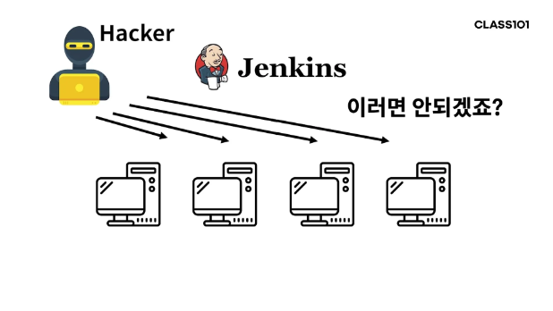

### 2023.08.27

이 내용은 크리에이터 푸님의 "현직 대기업 개발자 푸와 함께하는 진짜 백엔드 시스템 실무!" 강의를 기반으로 정리하였습니다.

강의 링크  
(https://class101.net/ko/products/T6HT0bUDKIH1V5i3Ji2M)
---

#### 목표
- jenkins 세팅
- 빌드와 배포
- 애플리케이션 배포 자동화

전 단계에서 push 후 pull 받았던 과정을 젠킨스를 사용하여 자동화한다.

  
#### 젠킨스란?
> 소프트웨어 개발과 지속적인 통합 및 지속적인 제공(CI/CD) 프로세스를 지원하는 오픈 소스 도구이다. 다음과 같은 주요 기능을 제공한다.  


#### 주요 기능
- 지속적인 통합(CI): Jenkins는 소스 코드 변경 사항을 자동으로 감지하고, 이러한 변경 사항을 컴파일하고 테스트하며, 빌드하고 배포하는 프로세스를 자동화한다. 이를 통해 팀은 코드의 품질을 높이고 버그를 빨리 발견할 수 있다.
- 지속적인 제공(CD): Jenkins는 코드 변경 사항이 테스트 및 QA단계를 통과하면 자동으로 프로덕션 환경으로 배포될 수 있도록 지원한다. 이로써 소프트웨어의 신속한 출시가 가능해진다.
- 자동화: Jenkins는 다양한 작업 및 프로세스를 자동화 할 수 있는 확장성 있는 플러그인 아키텍처를 제공하므로, 사용자 정의 작업 및 통합이 가능하다.
- 보고와 모니터링: Jenkins는 빌드 및 배포 상태에 대한 정보를 실시간으로 제공하며, 문제가 발생하면 경고 및 알림을 생성하여 조치를 취할 수 있게 한다.  

---

#### 실습
인스턴스 생성하기
- jenkins 인스턴스
- worker 인스턴스

젠킨스 인스턴스
- name: jenkins-instance-1
- 서울/e2 micro
- 20gb 표준 영구 디스크 centos7
- http, https 체크

워커 인스턴스
- name: cpu-worker-instance-1
- 서울/e2 micro
- 20gb 표준 영구 디스크 centos7
- http, https 체크

---

#### 젠킨스 인스턴스 ssh로 접속 후 세팅
```
# wget 설치
> sudo yum install wget

# maven 설치
> sudo yum install maven

# git 설치
> sudo yum install git

# docker 설치
> sudo yum install docker
```

```
# 젠킨스 설치시 패키지 추가 필요
> sudo wget -O /etc/yum.repos.d/jenkins.repo https://pkg.jenkins.io/redhat-stable/jenkins.repo
> sudo rpm --import https://pkg.jenkins.io/redhat-stable/jenkins.io.key

# 젠킨스 설치
sudo yum install jenkins 
 
# 젠킨스 실행 
sudo systemctl start jenkins

# 젠킨스 running 상태 확인
sudo systemctl status jenkins 
```

#### [에러]
Jenkins 실행시 에러 발생하는 경우

원인1: 인스턴스 메모리 부족  
해결1: 인스턴스 메모리 부족인 경우 e2-micro -> medium으로 변경

원인2: Java 버전 차이 (Maven 설치시 기본 Java 8 설치가 되는데, Jenkins 권장은 JDK 11, 17)  
해결2: Java 버전 차이인 경우 아래 명령어로 Java 버전 변경
```
# JDK 11 설치
$ sudo yum install java-11-openjdk-devel

# Default Java 버전 설정
# 설치된 JDK 목록이 출력되며, 숫자를 입력하여 Default Java 버전 변경 가능
$ sudo alternatives --config java

Selection Command
-----------------------------------------------
*+ 1 java-1.8.0-openjdk.x86_64 (/usr/lib/jvm/java-1.8.0-openjdk-1.8.0.362.b08-1.el7_9.x86_64/jre/bin/java)
2 java-11-openjdk.x86_64 (/usr/lib/jvm/java-11-openjdk-11.0.18.0.10-1.el7_9.x86_64/bin/java)

Enter to keep the current selection[+], or type selection number: 2

# Jenkins 실행
$ sudo systemctl start jenkins

# Jenkins status 확인
$ sudo systemctl status jenkins
```

---

#### GCP 8080번 포트 열기
방화벽 규칙 > 방화벽 규칙 만들기

```
name: jenkins-web
로그x
네트워크: default 
우선순위: 1000
트래픽 방향: 수신
일치시 작업: 허용
대상:네트워크의 모든 인스턴스
iP범위:0.0.0.0/0
지정된 프로토콜 및 포트 tcp:8080
```

8080포트 열고 젠킨스 인스턴스 외부ip:8080 접속 시 Unlock Jenkins를 해제해야 한다.  
젠킨스 인스턴스로 접속하여 Administrator password를 확인한다.

```
# 비밀번호 확인
> sudo cat /var/lib/jenkins/secrets/initialAdminPassword  
```

Customize Jenkins 추천플러그인만 설치(Install suggested plugins) > 앞으로 사용할 정보입력 > Save And Config 버튼 선택


#### publish over ssh 플러그인 설치
Jenkins 관리 -> Plugins -> Available plugins -> ssh 입력 후 Publish Over SSH 설치

---

#### 주의사항
jenkins가 worker instance로 접속하여 docker를 pull받아 run시키는 것  

*주의해야할 점은 jenkins 인스턴스만 접속할수 있도록 만들어야 한다.

 

워커 인스턴스에 접속 하여 배포하는 과정을 젠킨스 인스턴스만 접속할 수 있어야 한다.  
(해커나 다른 외부에서 배포가 가능하다면 문제가 발생한다)

대칭키와 비대칭키
: 대칭키는 암호화키와 복호화키가 동일  
비대칭키는 공개키와 개인키로 이루어진 키

비대칭키를 사용하여 젠킨스 인스턴스의 개인키로 암호화한 정보를 워커 인스턴스에 복사해놓고,  
jenkins에서 개인키로 암호화한 것을 젠킨스 공개키로 복호화함으로써 jenkins의 신원을 보장한다.  
(a에서 비대칭키를 생성하고, a의 개인키로 암호화하면 a의 공개키로만 복호화할 수 있다.  
따라서 b에서 a의 공개키를 가지고 있다가 a의 공개키로 복호화된다면 a임을 보장할 수 있다.)

---

```
# 개인키와 공개키 쌍 생성 password 입력 없이 enter
> ssh-keygen -t rsa -f ~/.ssh/id_rsa 

# 생성된 개인키와 공개키 확인 (id_rsa.pub: 공개키, id_rsa: 개인키)
> cd .ssh
> ls 

# 공개키를 열고, 처음부터 끝까지 복사한다
vi id_rsa.pub 
```

#### 젠킨스에서 생성한 공개키를 worker instance 접속해 복사

```
# 가장 아래로 a 입력 insert 모드에서 ctrl+v 정상등록확인 필요
# 복사 후 :wq 입력
> vi ~/.ssh/authorized_keys

# 권한 변경
chmod 700 ~/.ssh 
chmod 600 ~/.ssh/authorized_keys
```
---

#### 젠킨스 환경설정
젠킨스 접속 > 시스템 설정 > ssh에 개인키, cpu인스턴스 등록
입력 후 Test Configuration

```
# 개인키 확인
> vi ~/.ssh/id_rsa 

# 홈 디렉토리 확인
> cd ~
> cd pwd 
```

SSH Server에 Name: 인스턴스명, HostName: 내부ip, username은 shell의 아이디, remote directory는 홈디렉토리를 작성한다.

---

#### 배포스크립트 작성
젠킨스 > item > Freestyle project > OK  
하단에 빌드 후 조치 추가 > Send build artifacts over SSH

고급버튼 누르고 verbose output in console 체크(체크 시, 로그 자세히 출력한다.)

exec command에 명령어 입력 후 저장
```
sudo docker run -p 80:80 psy3720/spring-boot-cpu-bound
```

build now 선택 후 결과는 콘솔 출력에서 확인할 수 있다.
exec command에 적은 sudo 명령어 제거, 왼쪽에 있는 포트 8080 외부포트 수정

---

#### cpu worker 인스턴스에 docker 설치
worker 인스턴스에 docker로 pull 받아 컨테이너를 실행하기 위해 docker를 설치한다.

```
# docker 설치
> sudo yum install docker

# docker 실행
> sudo systemctl start docker

# docker 권한 설정
> sudo chmod 666 /var/run/docker.sock
```

Build now 버튼 눌러 배포 확인 하기  
-> 백그라운드로 실행하지 않으면, 배포가 끝나지 않은걸로 인식된다. 따라서 젠킨스에서 script를 백그라운드로 실행하도록 수정해야 한다. exec command 명령을 다음과 같이 수정한다.

```
nohup sudo docker run -p 80:80 psy3720/spring-boot-cpu-bound > /dev/null 2>&1 &
```
- 'nohup': no hang up의 약어로, 현재 세션과 무관하게 명령을 실행하고 터미널 연결이 끊겨도 명령이 계속 실행되도록 한다. 이렇게 하면 사용자가 로그아웃하거나 터미널을 닫아도 프로세스가 종료되지 않는다.
- 'sudo docker run -p 80:80 psy3720/spring-boot-cpu-bound' : Docker 컨테이너를 실행하는 명령이다. 이 부분에서 'psy3720/spring-boot-cpu-bound' 이미지를 실행하고 호스트의 포트 80을 컨테이너의 포트80으로 매핑한다. 즉 외부에서 호스트의 포트 80으로 들어오는 요청은 이 컨테이너로 전달된다.
- '> /dev/null 2>&1': 이 부분은 표준 출력과 표준오류를 /dev/null로 리디렉션하는 부분이다. '/dev/null'은 휴지통 같은 것으로, 여기에 보낸 데이터는 버려지기 때문에 출력을 무시하고 저장하지 않게 된다. '2>&1'표준 오류를 표준 출력으로 리디렉션하는 것을 나타낸다.
- '&': 이 부분은 명령을 백그라운드에서 실행하도록 한다. 즉 명령을 실행하고 터미널 제어권을 다시 돌려받는다.

따라서 이 명령은 Docker 컨테이너를 백그라운드에서 실행하고, 모든 출력을 무시하여 사용자와 터미널 연결과 무관하게 실행되도록 한다. 

