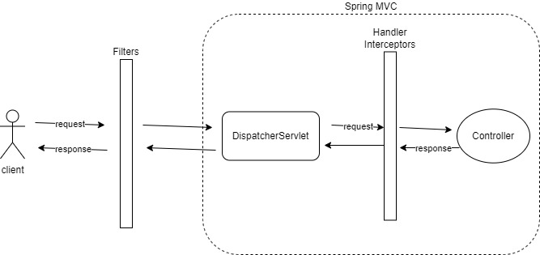

Servlet Filter vs Spring Interceptor vs AOP?
> Servlet Filter, Spring Interceptor, AOP(Aspect-Oriented Programming)은 웹 애플리케이션에서 요청 처리 및 로직 실행에 대한 각기 다른 접근방식을 제공하는 기술이다.

---
Servlet Filter:
특징
- Java Servlet 스펙의 일부로, 모든 요청과 응답에 대한 필터링 및 가로채기 기능을 제공한다.
- 웹 애플리케이션의 URL 패턴 또는 서블릿과 관련하여 사용할 수 있다.
- 요청 전후에 실행되며 HTTP 요청 및 응답 데이터를 수정하거나 조작할 수 있다.
- dispatcher servlet에 요청 전후로 실행된다.

장단점
- 웹 애플리케이션의 모든 요청에 대한 접근이 가능하며, 기본적인 보안검사, 로깅, 인증, 압축 등과 같은 일반적인 작업에 유용하다.
- 서블릿 컨테이너와 독립적으로 작동하므로 다양한 환경에서 사용할 수 있다.
- HTTP 요청 및 응답 데이터에 대한 저수준 접근을 제공하므로 복잡한 로직을 구현하기에는 부적합할 수 있다.
- 다양한 필터가 서로 상호작용 할 때 순서 및 관리가 어려울 수 있다.

제공 메서드
- init()
- doFilter()
- HttpServletRequest, HttpServletResponse, FilterChain가 파라미터로 전달된다.
- FilterChain의 doFilter 메서드를 실행해야 다음 필터로 요청이 넘어간다.(만약 메서드를 호출하지 않는 경우 다음 필터가 호출되지 않음)
- 직접적인 인증이나 부가작업은 이곳에서 처리하면 된다.
- destroy()

등록하는 방법
- @Component
- @WebFilter + @ServletComponentScan
- FilterRegistrationBean 사용(이 방법을 권장)

---
스프링 인터셉터
특징
- 스프링이 제공하는 기술
- 디스패처 서블릿이 컨트롤러를 호출하기 전/후 요청에 대해 부가작업을 처리하는 객체
- 스프링 컨텍스트 내에서 동작하며 스프링 빈과 함께 사용할 수 있다.
- 주로 스프링 MVC 애플리케이션에서 사용되며 URL 패턴 또는 컨트롤러 메서드와 관련하여 설정된다.

장단점
- 스프링 빈과 함께 동작하므로 의존성 주입 및 스프링의 다른 기능을 활용할 수 있다.
- 스프링 MVC와 높은 통합성을 가지며 컨트롤러 단위에서 사용하기에 적합하다.
- 스프링 프레임워크에 의존하므로 순수한 서블릿 환경에서는 사용할 수 없다.

제공 메서드
- preHandle()
- 핸들러가 실행되기 전 공통로직 실행
- postHandle()
- 핸들러가 실행된 이후
- afterCompletion()
- 핸들러가 실행된 이후 동작

등록하는 방법
- WebMvcConfigurer를 구현하고 addInterceptors 메서드를 사용하여 등록할 수 있다.

---
필터 vs 인터셉터

필터
- 자바 표준 스펙이다.
- 다음 필터를 실행하기 위해 개발자가 명시적으로 작성해줘야 한다.
- ServletRequest, ServletResponse를 필터 체이닝 중간에 새로운 객체로 바꿀 수 있다.
- 필터에서 예외가 발생하면 @ControllerAdvice에서 처리하지 못한다.

인터셉터
- 스프링에서 제공하는 기술이다.
- 다음 인터셉터를 실행하기 위해 개발자가 신경써야 하는 부분이 없다.
- ServletRequest, ServletResponse를 인터셉터 체이닝 중간에 새로운 객체로 바꿀 수 없다.
- 인터셉터에서 예외가 발생하면 @ControllerAdvice에서 처리가 가능하다.

---
필터와 인터셉터는 언제 사용해야 할까?
- 웹과 관련된 공통관심사는 URL 정보나 header에 관련 객체를 직접 다룰 수 있기 때문에 filter 또는 interceptor를 사용해서 처리하자.
- 큰 범위, 웹범위는 필터
- 인가처리, 스프링에 관련된 기술은 인터셉터

---
AOP(Aspect Oriented Programming)
> 여러 객체에 공통으로 적용할 수 있는 기능을 분리해서 개발자는 반복 작업을 줄이고 핵심 기능 개발에 집중할 수 있다.

특징
- AOP는 횡단관심사를 모듈화하여 애플리케이션의 여러 부분에서 재사용 가능한 관점을 정의하는 프로그래밍 패러다임이다.
- Spring Framework의 AOP 모듈을 사용하여 메서드 호출 및 객체 생명주기와 관련하여 관심사를 삽입할 수 있다.
- 메서드 실행 전,후 또는 예외 발생 시 관점을 적용할 수 있다.

장단점
- 모듈화된 관심사를 사용하여 코드 중복을 최소화하고 비즈니스 로직과 횡단관심사를 분리한다.
- 다양한 객체 및 메서드에 관점을 적용할 수 있으며, 재사용성과 유지 관리성이 향상된다.
- 학습 곡선이 높고 오용하기 쉽다.
- 관점을 정의하고 설정하기에 일정한 노력이 필요하며, 오버헤드가 발생할 수 있다.

- 중복코드가 발생하여 공통로직으로 분리하고자 할때 프록시를 사용할 수 있다.

프록시란?
: 클라이언트가 사용하는 것을 실제 대상인 것처럼 위장해서 클라이언트 요청을 받아주는 것(대리자, 대리인, 가짜 객체..)

사용 목적에 따라
1. 클라이언트가 타깃에 접근하는 방법을 제어하기 위해 -> 프록시 패턴
2. 타깃에 부가적인 기능을 부여하기 위해 -> 데코레이터 패턴

핵심기능의 코드를 수정하지 않으면서 공통 기능의 구현을 추가하는 것

AOP 용어
- Target Object: 부가기능을 부여할 대상
- Join point: advice(부가기능)가 적용될수 있는 지점
- Aspect: 부가될 기능을 정의한 advice와 어드바이스를 어디에 적용할지 결정하는 pointcut을 함께 가진다.
- advice 무엇을 언제할지를 정의
- pointcut: joinpoint를 선별하는 작업

구현하는 방법
- 컴파일 시점
- 클래스 로딩시점
- 런타임 시점
 