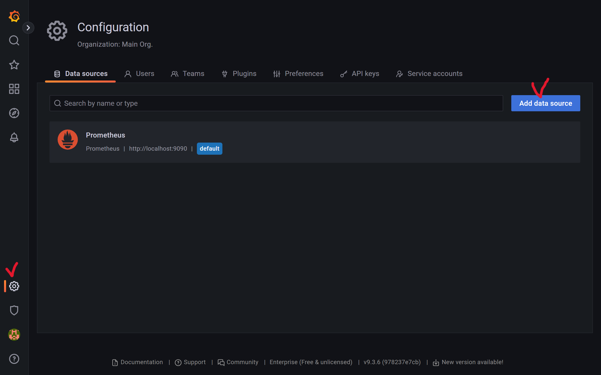
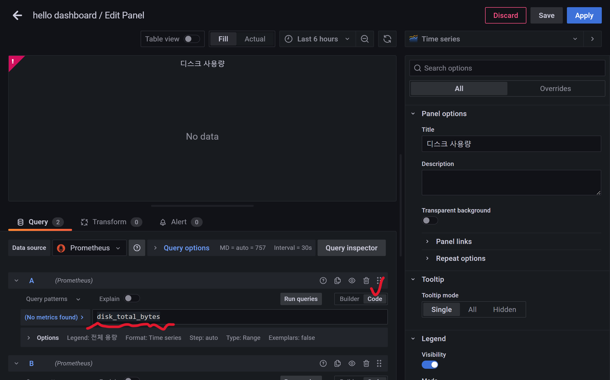
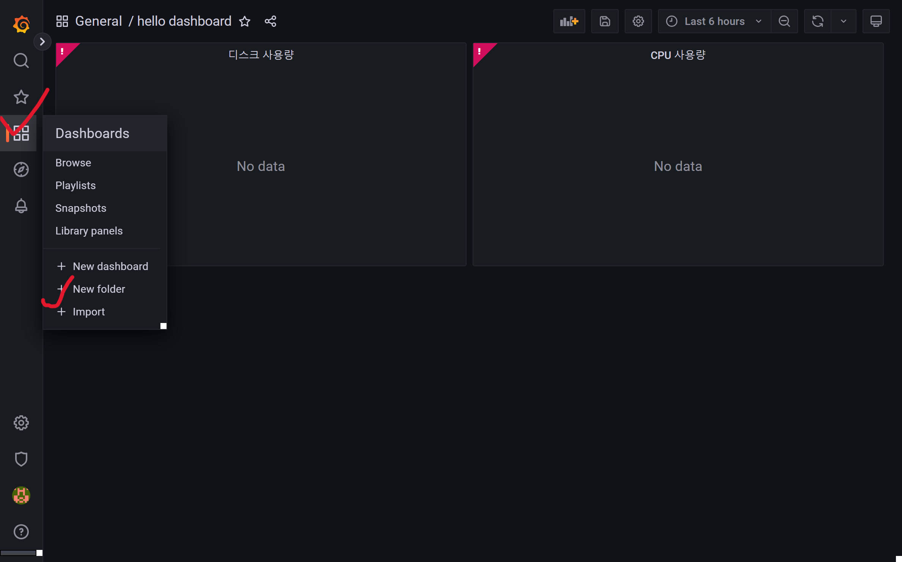

### 2023.08.14

이 내용은 김영한님의 "스프링 부트 - 핵심 원리와 활용" 강의를 기반으로 정리하였습니다.

----

#### 그라파나
그라파나는 오픈 소스 데이터 시각화 및 모니터링 도구이다. Grafana를 사용하면 다양한 데이터 소스에서 데이터를 추출하여 시각적으로 표현하고 모니터링 할 수 있다.

그라파나는 프로메테우스에 수집된 데이터를 시각적으로 표현하고 모니터링 대시보드를 생성하는 역할을 수행할 수 있다.

---

#### 그라파나 설치
(https://grafana.com/grafana/download)
본인의 OS에 맞게 다운로드 한다.

#### 실행
- 압축을 푼 곳에서 bin/grafana-server.exe를 실행한다.
- (http://localhost:3000)에 접속
- 기본 계정(email or username: admin, Password: admin)으로 로그인 -> Skip 선택

---
#### 그라파나 연동

- 왼쪽 하단의 설정(Configuration) 버튼에서 Data sources 선택
- Add data source 선택
- Prometheus 선택

Prometheus 설정값
URL: http://localhost:9090(프로메테우스 url)

- Save & test 선택

---

#### 그라파나 - 대시보드 만들기

대시보드를 만들기 전에 애플리케이션, 프로메테우스, 그라파나 3가지 모두 실행해야 한다.

#### 대시보드 저장
1. 왼쪽 Dashboards 메뉴 선택
2. New 버튼 선택 -> New Dashboard 선택
3. 오른쪽 상단의 Save dashboard 저장 버튼(disk 모양)선택
4. Dashboard name 입력 후 저장

#### 대시보드 확인
1. 왼쪽 Dashboards 메뉴 선택
2. 앞서 만든 대시보드 선택

#### 대시보드에 패널만들기
대시보드=틀, 패널=컴포넌트  


1. 오른쪽 상단의 Add panel 버튼(차트 모양)선택
2. Add a new panel 메뉴 선택
3. 패널의 정보를 입력할 수 있는 화면 나타남
4. 아래에 보면 Run queries 버튼 오른쪽에 Builder, Code라는 버튼 중 Code 선택
5. Enter a PromQL query... 부분에 메트릭을 입력한다.

---

#### CPU 메트릭 만들기
- system_cpu_usage: 시스템의 CPU 사용량
- process_cpu_usage: JVM 프로세스 CPU 사용량

PromQL에 system_cpu_usage 입력 후 Run queries 버튼 선택

+ Query 버튼 선택해서 process_cpu_usage 추가

#### 그래프 데이터 이름 변경
패널 그래프 하단의 Legend(범례)라고 하는 차트에 제공하는 데이터 종류를 구분하는 텍스트가 JSON으로 표시되어 있다.

Options -> Legend 선택 후 Custom -> 변경할 텍스트 입력

#### 패널 이름 설정
오른쪽에 Panel options의 Title을 변경

#### 패널 저장
화면 오른쪽 상단의 Save 또는 Apply 버튼 선택

---

그라파나 - 공유 대시보드 활용
: 스프링 부트와 마이크로미터를 사용해서 만든 수 많은 대시보드가 있다.
아래의 사이트에서 "spring" 키워드로 검색해보면 다양한 대시보드를 확인할 수 있다.

(https://grafana.com/grafana/dashboards)

##### 스프링 부트 시스템 모니터 대시보드 불러오기
(https://grafana.com/grafana/dashboards/11378-justai-system-monitor/)

사이트에 접속 후 Copy Id to clipboard 또는 ID: 11378의 숫자를 저장한다.

#### 대시보드 불러오기


1. 그라파나 접속 후 왼쪽 Dashboards 메뉴 선택
2. New 버튼 선택 -> Import 선택
3. 불러올 대시보드 숫자(11378)를 입력하고 Load 버튼 선택
4. Prometheus 데이터소스를 선택하고 Import 버튼 선택

불러온 대시보드 수정
: 대시보드를 수정하려면 수정모드로 변경해야 한다.
오른쪽 상단의 설정 버튼(톱니바퀴, Dashboard settings) 선택 -> Make editable 선택

Jetty 통계 -> Tomcat 통계
#### Thread Config Max 패널 설정 변경
- jetty_threads_config_max -> tomcat_threads_config_max_threads
- jetty_htreads_current -> tomcat_threads_current_threads
- jetty_threads_busy -> tomcat_threads_busy_threads
- jetty_threads_idle, jetty_threads_jobs 제거

---

#### 그라파나 - 메트릭을 통한 문제 확인
애플리케이션에 문제가 발생했을 때 그라파나를 통해 어떻게 모니터링 하는지 확인

다음 4가지 경우를 확인한다.
- CPU 사용량 초과
- JVM 메모리 사용량 초과
- 커넥션 풀 고갈
- 에러 로그 급증

1. CPU 사용량 초과
   cpu에 간단히 부하를 주는 코드를 작성한다.

```
import lombok.extern.slf4j.Slf4j;
import org.springframework.web.bind.annotation.GetMapping;
import org.springframework.web.bind.annotation.RestController;

@Slf4j
@RestController
public class TrafficController {

    @GetMapping("/cpu")
    public String cpu() {
        log.info("cpu");
        long value = 0;

        for(long i = 0; i< 100000000000L; i++) {
            value++;
        }
        return "ok value=" + value;
    }
}

```

---

2. JVM 메모리 사용량 초과
   메모리 사용을 누적하는 코드를 추가

```
import lombok.extern.slf4j.Slf4j;
import org.springframework.web.bind.annotation.GetMapping;
import org.springframework.web.bind.annotation.RestController;

import java.util.ArrayList;
import java.util.List;

private List<String> list = new ArrayList<>();

@GetMapping("/jvm")
public String jvm() {
	log.info("jvm");
	for(int i=0; i<1000000; i++) {
		list.add("hello jvm!" + i);
	}
	return "ok";
}
```

---

3. 커넥션 풀 고갈
```
import lombok.extern.slf4j.Slf4j;
import org.springframework.beans.factory.annotation.Autowired;
import org.springframework.web.bind.annotation.GetMapping;
import org.springframework.web.bind.annotation.RestController;

import javax.sql.DataSource;
import java.sql.Connection;
import java.sql.SQLException;

@Autowired
DataSource dataSource;

@GetMapping("/jdbc")
public String jdbc() throws SQLException {
	log.info("jdbc");
	Connection conn = dataSource.getConnection();
	log.info("connection info={}", conn);
	return "ok";
}
``` 

---
4. 에러로그 급증
```
import lombok.extern.slf4j.Slf4j;
import org.springframework.web.bind.annotation.GetMapping;
import org.springframework.web.bind.annotation.RestController;

@GetMapping("/error-log")
public String errorLog() {
	log.error("error log");
	return "error";
}
```

---

!!참고
: 메트릭을 보는 것은 정확한 값을 보는 것이 목적이 아닌 대략적인 값과 추세를 확인하는 것이 목적이다.