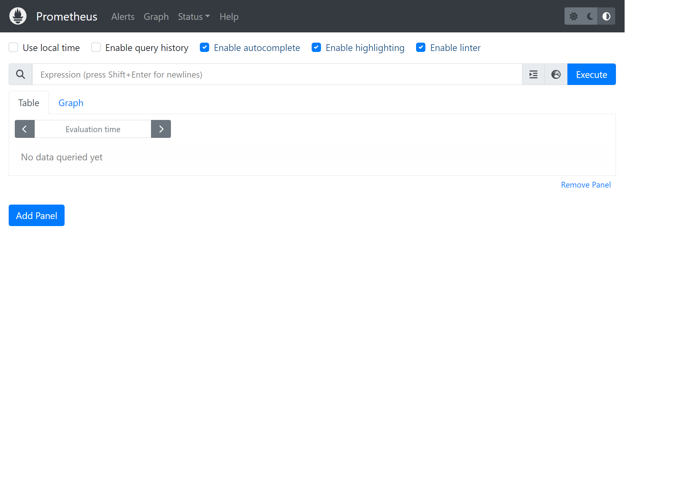

### 2023.08.11

이 내용은 김영한님의 "스프링 부트 - 핵심 원리와 활용" 강의를 기반으로 정리하였습니다.

----

### 마이크로미터
마이크로미터(Micrometer)는 스프링부트 기반의 애플리케이션에서 메트릭 수집과 모니터링을 위한 라이브러리이다.
애플리케이션의 다양한 측면에서 발생하는 데이터를 수집하고,이 데이터를 시각화하거나 외부 시스템에 전달하여 애플리케이션의 상태와 성능을 모니터링할 수 있도록 지원한다.

모니터링 툴에 종속되지 않도록 설계되어 메트릭 데이터를 외부 시스템에 전송하는 방식에 있어 다양한 모니터링툴과 통합할 수 있는 기능을 제공한다.

---

#### 메트릭 확인하기
마이크로미터는 다양한 지표 수집기능을 이미 만들어서 제공한다.

metrics 엔드포인트
(http://localhost:8080/actuator/metrics)

자세히 확인하려면 다음과 같이 확인할 수 있다.
(http://localhost:8080/actuator/metrics/{name})

jvcm 메모리 사용량 확인
(http://localhost:8080/actuator/metrics/jvm.memory.used)

#### Tag 필터
Tag를 기반으로 정보를 필터링해서 확인할 수도 있다.
tag=Key:Value과 같은 형식을 사용한다.

(http://localhost:8080/actuator/metrics/jvm.memory.used?tag=area:heap)
(http://localhost:8080/actuator/metrics/jvm.memory.used?tag=area:nonheap)

HTTP 요청수 확인
(http://localhost:8080/actuator/metrics/http.server.requests)

---

#### 다양한 메트릭

1. JVM 메트릭
> JVM 관련 메트릭을 제공한다. jvm.으로 시작한다.
- 메모리 및 버퍼 풀 세부 정보
- 가비지 수집 관련 통계
- 스레드 활용
- 로드 및 언로드된 클래스 수
- JVM 버전 정보
- JIT 컴파일 시간

2. 시스템 메트릭
> 시스템 메트릭을 제공한다. system., process., disk.으로 시작한다.

- CPU 지표
- 파일 디스크립터 메트릭
- 가동 시간 메트릭
- 사용 가능한 디스크 공간

3. 애플리케이션 시작 메트릭
> 애플리케이션 시작 시간 메트릭을 제공한다.
- application.started.time: 애플리케이션을 시작하는데 걸리는 시간(ApplicationStartedEvent로 측정)
- application.ready.time: 애플리케이션이 요청을 처리할 준비가 되는데 걸리는 시간(ApplicationReadyEvent로 측정)

4. 스프링 MVC 메트릭
> 스프링 MVC 컨트롤러가 처리하는 모든 요청을 다룬다. http.server.requests

tag를 사용해서 다음 정보를 분류확인 가능
- uri
- method
- status
- exception
- outcome: 상태코드를 그룹으로 모아서 확인(1xx: INFORMATIONAL, 2xx:SUCCESS, 3xx:REDIRECTION, 4xx:CLIENT_ERROR, 5xx:SERVER_ERROR)

5. 데이터 소스 메트릭
> DataSource, 커넥션 풀에 관한 메트릭을 확인할 수 있다.
jdbc.connections.로 시작한다.
최소/최대 커넥션, 활성/대기 커넥션 수 등을 확인할 수 있다.

6. 로그 메트릭
> logback.events: logback 로그에 대한 메트릭을 확인할 수 있다.
trace, debug, info, warn, error 각각의 로그 레벨에 따른 로그 수를 확인할 수 있다.

7. 톰캣 메트릭
> 톰캣 메트릭은 tomcat.으로 시작한다. 톰캣 메트릭을 모두 사용하려면 다음 옵션을 사용한다.

application.yml
 ```
 server:
   tomcat:
     mbeanregistry:
	   enabled: true
 ```
---

### 프로메테우스와 그라파나

프로메테우스  
: 애플리케이션에서 발생한 메트릭을 현재뿐만 아니라 과거 이력까지 함께 확인하려면 메트릭을 보관하는 DB가 필요하다. 이렇게 하려면 메트릭을 지속해서 수집하고 DB에 저장해야 한다. 프로메테우스는 이런 역할을 담당한다.

그라파나
: 프로메테우스가 DB라고 한다면, DB에 있는 데이터를 불러서 사용자가 보기 편하게 보여주는 대시보드가 필요하다. 그라파나는 데이터를 그래프로 보여주는 툴이다.


전체 프로세스


1. 스프링부트 액츄에이터와 마이크로미터를 사용하여 수 많은 메트릭을 자동으로 생성한다.
- 마이크로미터 프로메테우스 구현체는 프로메테우스가 읽을 수 있는 포멧으로 메트릭을 생성한다.
2. 프로메테우스는 이렇게 만들어진 메트릭을 지속해서 수집한다.
3. 프로메테우스는 수집한 메트릭을 내부 DB에 저장한다.
4. 사용자는 그라파나 대시보드 툴을 통해 그래프로 편리하게 메트릭을 조회한다. 이때 필요한 데이터는 프로메테우스를 통해서 조회한다.

---

#### 프로메테우스 - 설치

1. 본인의 OS에 맞는 파일을 다운로드 한다.
   (https://prometheus.io/download/)

2. 다운로드 받은 파일을 열어 프로메테우스를 실행한다.
```
 ./prometheus
```
3. 접속하여 확인 (http://localhost:9090)



---

#### 프로메테우스 - 애플리케이션 설정
1. 애플리케이션 설정: 프로메테우스가 애플리케이션의 메트릭을 가져갈 수 있도록 애플리케이션에서 프로메테우스 포멧에 맞추어 메트릭 생성
2. 프로메테우스 설정: 프로메테우스가 우리 애플리케이션의 메트릭을 주기적으로 수집하도록 설정


#### 애플리케이션 설정
build.gradle 추가
```
implementation 'io.micrometer:micrometer-registry-prometheus'
```
- 마이크로미터 프로메테우스 구현 라이브러리를 추가한다.
- 스프링 부트와 액츄에이터가 자동으로 마이크로미터 프로메테우스 구현체를 등록해서 동작하도록 설정해준다.
- 액츄에이터에 프로메테우스 메트릭 수집 엔드포인트가 자동으로 추가된다.(/actuator/prometheus)

#### 프로메테우스 수집 설정
prometheus.yml
```
scrape_configs:
  # The job name is added as a label `job=<job_name>` to any timeseries scraped from this config.
  - job_name: "prometheus"

    # metrics_path defaults to '/metrics'
    # scheme defaults to 'http'.

    static_configs:
      - targets: ["localhost:9090"]
  # 추가된 부분	  
  - job_name: "spring-actuator"
    metris_path: "/actuator/prometheus"
    scrape_interval: 1s
    static_configs: 
      - targets: ['localhost:8080']
```
scrape_configs 하위에 옵션을 추가해준다.
- job_name: 수집하는 이름
- metrics_path: 수집할 경로
- scrape_interval: 수집할 주기
- targets: 수집할 서버의 IP, PORT

!! 수집 주기는 너무 짧을 경우 애플리케이션 성능에 영향을 줄 수 있으므로 10s ~ 1m 정도를 권장(시스템 상황에 따라 지정)
#### 설정 후 프로메테우스 서버를 종료하고 다시 실행


#### 프로메테우스 연동 확인
1. 프로메테우스 메뉴 > Status > Configuration에 들어가서 추가된 부분이 있는지 확인한다.
   (http://localhost:9090/config)

2. 프로메테우스 메뉴 > Status > Targets에 들어가 연동이 잘 되었는지 확인


#### 프로메테우스 - 기본 기능
1. 프로메테우스 메뉴 > Graph에 접속하여 데이터를 조회할 수 있다.
- 태그,레이블: error, exception, instance... 등은 각각의 메트릭 정보를 구분해서 사용하기 위한 태그이다. 마이크로미터에서는 태그라하고 프로메테우스에서는 레이블이라 한다.
- 숫자: 끝에 마지막에 있는 숫자는 해당 메트릭의 값을 의미한다.

기본기능
: - Table: Evaluation time을 수정해서 과거 시간 조회 가능  
- Graph: 메트릭을 그래프로 조회 가능

필터  
: 레이블을 기준으로 필터를 사용할 수 있다. 필터는 중괄호({})문법을 사용한다.  
  
예시)
- uri=/log, method=GET 조건으로 필터
  - http_server_requests_seconds_count{uri="/log", method="GET"}
- /actuator/prometheus는 제외한 조건으로 필터
  - http_server_requests_seconds_count{uri!="/actuator/prometheus"}
- method가 GET, POST인 경우를 포함해서 필터
  - http_server_requests_seconds_count{method=~"GET|POST"}
- /actuator로 시작하는 uri는 제외한 조건으로 필터
  - http_server_requests_seconds_count{uri!~"/actuator.*"}

---

#### 프로메테우스 - 게이지와 카운터
> 메트릭은 크게 보면 게이지와 카운터라는 2가지로 분류할 수 있다. 게이지는 오르락 내리락 하는 값이고, 카운터는 특정 이벤트가 발생할 때 마다 그 수를 계속해서 누적하는 값이다.

- 게이지(Gauge): 임의로 오르내릴 수 있는 값  
예) CPU 사용량, 메모리 사용량, 사용중인 커넥션


- 카운터(Counter): 단순하게 증가하는 단일 누적 값  
예) HTTP 요청수, 로그발생 수

> HTTP 요청 메트릭을 그래프로 표현할때, 카운터는 계속 누적해서 증가하는 값이다. 계속 증가하는 그래프만 보게되는데 이렇게 증가만 하는 그래프는 특정 시간에 얼마나 고객의 요청이 들어왔는지 한눈에 확인하기 매우 어렵다. 이런 문제를 해결하기 위해 increase(), rate() 같은 함수를 지원한다.

#### 이미지 비교
함수 사용 전(증가하는 그래프)
 
함수 사용 


- increase()
: increase() 함수를 사용하면 지정한 시간 단위별로 증가를 확인할 수 있다. 마지막에 [시간]을 사용해서 범위 벡터를 선택해야 한다.  
예) increase(http_server_requests_seconds_count{uri="/log"}[1m])

- rate()
: 범위 백터에서 초당 평균 증가율을 계산한다.  
increase()가 숫자를 직접 카운트 한다면, rate()는 여기에 초당 평균을 나누어서 계산한다.

- irate()
: rate와 유사한데, 범위 벡터에서 초당 순간 증가율을 계산한다. 급격하게 증가한 내용을 확인하기 좋다.


#### [참고]
공식 메뉴얼
 - 기본기능: (https://prometheus.io/docs/prometheus/latest/querying/basics/)
 - 연산자: https://prometheus.io/docs/prometheus/latest/querying/operators/)
 - 함수: https://prometheus.io/docs/prometheus/latest/querying/functions/)